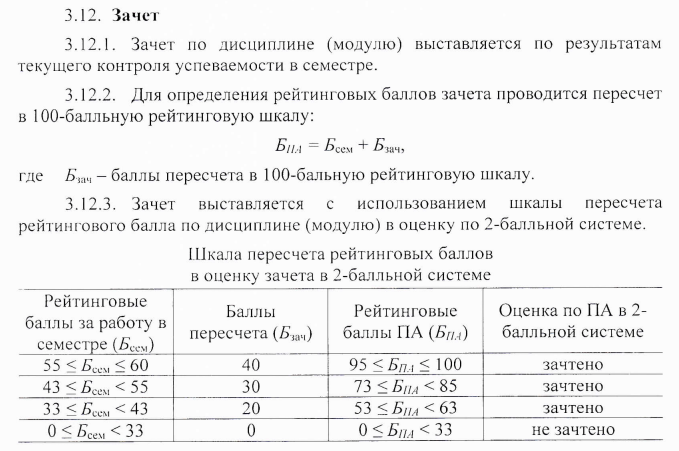

# Программирование python: быстрый старт

- Год поступления студентов: 2021;
- Всего: 72 часов = 32 аудиторная работа + 40 самостоятельная работа;
- Аудиторная работа: 32 часа = 16 часов лекций + 16 часов практики;
- Самостоятельная работа: 40 часов;
- Основной язык: Python;
- Аттестация: зачёт;

*\* Академический час - 45 минут, т.е. пол пары.*

 

## Ссылки на материалы курса

- Курс на мудле: [https://moodle.cfuv.ru/course/view.php?id=21634](https://moodle.cfuv.ru/course/view.php?id=21634);
- Материалы на GitHub: [https://github.com/VladimirChabanov/python_quick_start](https://github.com/VladimirChabanov/python_quick_start);
- Доступ к практическим заданиям: [заполните форму](https://docs.google.com/forms/d/e/1FAIpQLSfVEdg6V2tuoaMH1xvmOHTb-V1R1_LpdbYuhIVJkBMZQVWl8g/viewform?usp=sf_link);

 

## Система оценивания

Порядок расчёта баллов за экзамен - фрагмент приказа №135 от 11.02.2020 "Об утверждении Порядка применения балльно-рейтинговой системы оценивания успеваемости обучающихся по программам ВО в ФГАОУ ВО "КФУ им. В.И. Вернадского":

### Расчёт баллов за работу в семестре (Бсем)

Балл за работу в семестре определяется как сумма баллов по всем контрольным точкам (55 баллов) + бонусные баллы (5 баллов):

$$Б_{сем} = Б_{кт1} + Б_{кт2} + Б_{кт3} + Б_{кт4}+Б_{бонус}$$

**Контрольная точка 1 (1 неделя - 2 неделя): 11 баллов**

- Практические занятия:
  - Посещение: 2 балл;
  - Выполнение практических задач: 9 баллов;

**Контрольная точка 2 (3 неделя - 4 неделя): 12 баллов**

- Практические занятия:
  - Посещение: 2 балл;
  - Выполнение практических задач: 10 баллов;

**Контрольная точка 3 (5 неделя - 6 неделя): 12 баллов**

- Практические занятия:
  - Посещение: 2 балл;
  - Выполнение практических задач: 10 баллов;

**Контрольная точка 4 (7 неделя - 8 неделя): 12 баллов**

- Практические занятия:
  - Посещение: 2 балл;
  - Выполнение практических задач: 10 баллов;

**Сводная:**

- Практические занятия:
  - Посещение: 8 балла;
  - Решение задач: 47 баллов;
- Бонус: 5 баллов (начисляются по усмотрению преподавателя ведущего практические занятия).
