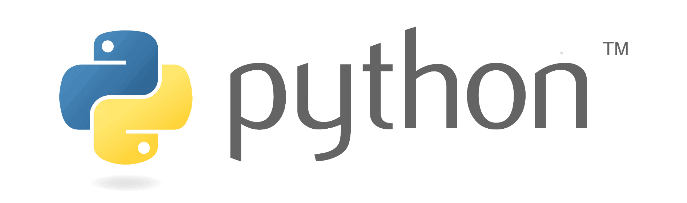

## Программирование python: быстрый старт

Методические материалы по модулю "Программирование python: быстрый старт" для студентов 2021 года поступления. Модуль является первой дисциплиной майнора "Программирование на Python и основы искусственного интеллекта".

- [О модуле](01_О_модуле.md)
- [О преподавателях](02_О_преподавателях.md)
- [Лекционные занятия](./01_lectures/ReadMe.md)
- [Практические занятия](./02_practice/ReadMe.md)
- [Самостоятельная работа](./03_individual/ReadMe.md)
- [Рекомендуемые источники](./04_sources/ReadMe.md)
